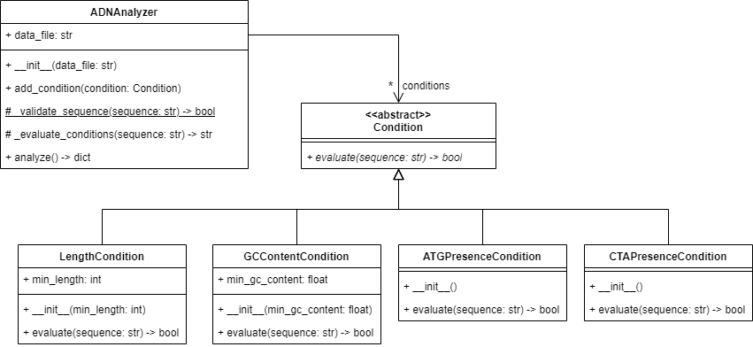

# Ejercicio Analizador ADN

La NASA ha enviado una sonda espacial a un planeta lejano en busca de formas de vida 
extraterrestre. La sonda ha recopilado muestras de material biológico y ha secuenciado 
el ADN de estas muestras. La NASA desea evaluar si estas secuencias de ADN cumplen con 
ciertas condiciones para determinar la viabilidad de la vida en el planeta.

El ADN es una molécula que contiene información genética y se representa generalmente 
con las letras A (adenina), T (timina), C (citosina) y G (guanina) que representan las 
bases nitrogenadas de la cadena de ADN.

La información que envió la sonda ha sido almacenada en un archivo con el siguiente formato:

```
>Organismo 1
ATGGGGCGGGGCCCCGGGCGCGCGCGGGGGGGGCCGCGGCGCCGCCCCCCGGCCTACTACTA
>Organismo 2
ATGCTACTACTACCTACTACTACTACTACTACTACTACTACTACTACTACTACTACTACTACTACTAGCTAGCTAGCTAGCTAGCTAGCTAGCTAGCTAGCTAGCTAGCTAGCTACTACTACTACTACTACTACTACTACTACTACTACTACTACTACTACTACTACTACTACTA
>Organismo 3
AGCCGCGCGCGCGCCGCCCGGGGCGCCCGGGCCCCCCCCCCGCGGGGCGCGCCCGGGGCGGCCTACTA
>Organismo 4
AGCAACCCACACACCCCACACACACCCAACCCACAACAACCAAAAAACACAACCAAACCAAACTACTA
>Organismo 5
AGACCAAAACCCAAAAACACCAAAAACCAACCCTACTA
```

Cada línea que comienza con `>` indica el comienzo de una nueva secuencia y proporciona 
información sobre el organismo al que pertenece. Las secuencias de ADN siguen debajo de 
cada encabezado.

Tú has sido contactado por la NASA para desarrollar un módulo de una aplicación que 
permita evaluar secuencias de ADN para determinar si cumplen las condiciones para que 
haya viabilidad de vida en el planeta.

Las condiciones son las siguientes:
1.	La secuencia debe tener más de 50 bases
2.	El contenido de las bases guanina (G) y citosina (C) debe ser superior al 60%
3.	La secuencia debe contener el motivo “ATG”
4.	La secuencia debe contener el motivo CTA al menos 3 veces

El módulo debe proporcionar una calificación de la secuencia de ADN en función de 
cuántas de las condiciones se cumplen.

- Si se cumplen las cuatro condiciones, se califica como “ADN perfecto, posible forma 
de vida”
- Si se cumplen tres de las cuatro condiciones, se califica como “ADN bueno”
- Si se cumplen dos de las cuatro condiciones, se califica como “ADN regular”
- Si se cumple solo una condición o ninguna, se califica como “ADN no satisfactorio”

Margaret, la arquitecta de software del proyecto, realizó el siguiente diseño del módulo:



Tu tarea es implementar el diseño que hizo Margaret, teniendo en cuenta las instrucciones 
que ella dejó:

* La clase `Condition` es una clase abstracta y su método `evaluate` es igualmente abstracto.
* La clase `LengthCondition` hereda de `Condition` y recibe un parámetro `min_length` en
el constructor que indica la longitud mínima que debe tener la secuencia de ADN para cumplir
la condición (el valor por defecto del parámetro es 50). Dicho parámetro se guarda en el atributo `min_length` de la clase.
* La clase `GCContentCondition` hereda de `Condition` y recibe un parámetro `min_gc_content` en
el constructor que indica el porcentaje mínimo de contenido de bases G y C que debe tener la 
secuencia de ADN para cumplir la condición (el valor por defecto del parámetro es 60). Dicho parámetro se guarda en el atributo
`min_gc_content` de la clase.
* Las clases `ATGPresenceCondition` y `CTAPresenceCondition` heredan de `Condition` y no
reciben parámetros en el constructor. Estas clases implementan la lógica para verificar si
la secuencia de ADN contiene los motivos “ATG” y “CTA” respectivamente.
* Las clases `LengthCondition`, `GCContentCondition`, `ATGPresenceCondition` y
`CTAPresenceCondition` implementan el método `evaluate` de la clase `Condition` con la
lógica correspondiente a cada condición para evaluar la secuencia recibida como parámetro.
* La clase `ADNAnalyzer` tiene una lista de condiciones que se inicializa en el constructor
como una lista vacía. Además, recibe un parámetro `data_file` en el constructor que indica
la ruta del archivo con las secuencias de ADN a analizar. Dicho parámetro se guarda en el
atributo `data_file` de la clase.
* El método `add_condition` de la clase `ADNAnalyzer` recibe un parámetro `condition` que
es una instancia de una subclase de `Condition` y agrega dicha instancia a la lista de
condiciones de la clase.
* El método `_validate_sequence` de la clase `ADNAnalyzer` es un método estático que recibe 
un parámetro `sequence` que es una secuencia de ADN. Este método verifica que la secuencia esté 
bien formada, retornado `True` si la validación pasa y `False` en caso contrario. Para esto, 
verifica que la secuencia solo contenga las letras A, T, C o G.
* El método `_evaluate_conditions` de la clase `ADNAnalyzer` recibe un parámetro `sequence`
que es una secuencia de ADN. Este método evalúa la secuencia con cada una de las condiciones
que se hayan agregado a la lista de condiciones. El método retorna un string con la calificación
de la secuencia de ADN en función de cuántas de las condiciones se cumplen.
* El método `analyze` de la clase `ADNAnalyzer` es el que lee el archivo con las secuencias
de ADN y evalúa cada una de las secuencias con las condiciones que se hayan agregado a la
lista de condiciones. Cada secuencia analizada es primero validada usando el método `_validate_sequence`. 
En caso de que alguna secuencia no pase la validación, el método arroja un error de tipo `ValueError` indicando
que 'El archivo contiene secuencias inválidas'. Luego, utiliza el método `_evaluate_conditions` 
para obtener la calificación de cada secuencia. El método debe retornar un diccionario con la calificación 
de cada secuencia de ADN. El diccionario tiene como clave el nombre del organismo y como valor el resultado de
la evaluación. Por ejemplo:
    
    ```
    {
        'Organismo 1': 'ADN perfecto, posible forma de vida',
        'Organismo 2': 'ADN bueno',
        'Organismo 3': 'ADN regular',
        'Organismo 4': 'ADN no satisfactorio',
        'Organismo 5': 'ADN no satisfactorio'
    }
    ```

Para realizar esta actividad puedes clonar este repositorio e implementar el código en el archivo
`adn.py` que se encuentra en el paquete `analyzer.model`.

## Para tener en cuenta

* El proyecto incluye un conjunto de pruebas que puedes utilizar para verificar el cumplimiento de los 
requisitos establecidos. Para ejecutar las pruebas, debes instalar la dependencia pytest
(`pip install pytest`).
* Para que las pruebas funcionen adecuadamente debes implementar el código respetando 
los nombres y la definición de las clases y los métodos que se presentan en el diagrama.
* La evaluación del ejercicio se hará con base en el cumplimiento de los requisitos que 
arrojen las pruebas. Por lo tanto, cualquier fallo en las pruebas debido a nombres mal 
escritos o que no concuerden con el modelo dado se considerará como un requisito no 
cumplido, afectando la calificación del examen. Igualmente, si las pruebas no ejecutan 
porque el código entregado tiene errores de sintaxis, se considerará como no 
cumplimiento de los requisitos. En este sentido, es importante que no entregues 
código que tenga errores de sintaxis simplemente por entregar cualquier cosa.